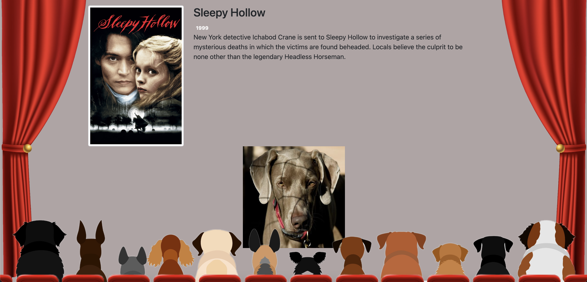

# HOLLYWOOF

## About

Hollywoof is a dog-themed movie curation app that lets the user personalize their recommendation through a series of questions asking about movie length, release date windows, and genres. Each answer they are able to select is represented through a dog image. Once a movie is chosen, the HTML of the page updates so that the movie recommendation is displayed, alongside a random dog image to go with the theme.

## Link

Explore this project [here](https://hollywoof.netlify.app/ "here")

## Screenshots

## Technologies Used
- [TMDB](https://developers.themoviedb.org/3/getting-started/introduction "TMDB")
- [DogCEO](https://dog.ceo/dog-api/ "DogCEO")
- HTML
- CSS
- BootStrap
- JavaScript
- APIs
- DOM Manipulation

## Creators
- Wes Fountain
- Matt Summers
- Khanh Trinh
